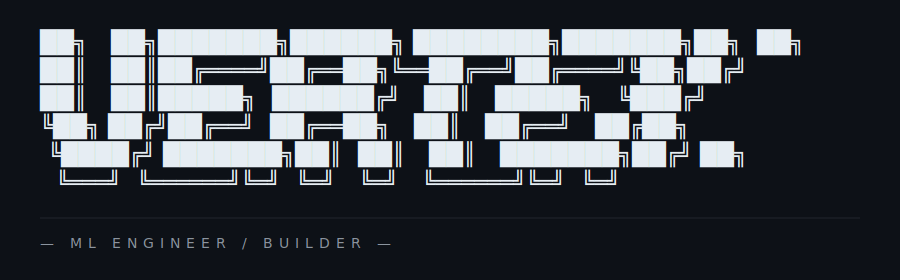

<picture>
  <source media="(prefers-color-scheme: dark)" srcset="./assets/vertex-hero-dark.svg">
  <source media="(prefers-color-scheme: light)" srcset="./assets/vertex-hero-light.svg">
  
</picture>

I build ML-driven products end to end — from data and models to the
backends and interfaces that put them in front of users. Currently
open to founder-led teams shipping something interesting.

---

## § 01 — Selected Work

<!-- Each project is one cell. Add a new project: append a row below following the same shape. -->

| | |
|---|---|
| **PROJECT_01 · LANG** `project-name` One-line description of what it does and why it matters. → [github.com/vertexvisionart/project-name](https://github.com/vertexvisionart/project-name) | **PROJECT_02 · LANG** `another-thing` Another one-liner. Tight. Result-oriented copy. → [github.com/vertexvisionart/another-thing](https://github.com/vertexvisionart/another-thing) |

---

## § 02 — Writing / Talks

<!-- Empty until first piece ships. Section header stays as a placeholder. -->

_No published writing yet. Posts and talks will appear here._

---

## § 03 — Activity

<!-- Wired in Task 5 after the snake Action runs for the first time. -->

_Activity graph regenerates daily — appears here after first workflow run._

---

## § 04 — Stats · § 05 — Contact

| | |
|---|---|
| **§ 04 — STATS**  _Wired in Task 5._ | **§ 05 — CONTACT**  ▸ [email](mailto:danilprolook333@gmail.com) ▸ [telegram](https://t.me/A1245623) |
